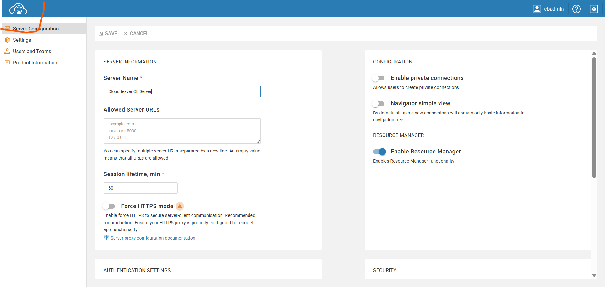

# Technical Test for MPA

This is a technical test from MPA. The technical test provide a task creating a docker environment to perform:
- Create a database. In this case, we will use PostgreSQL for the database and Cloudbeaver as a database manager
- Create a program to ingest data from `.csv` files into the database and perform a transformation process on the data within the database. For this, we will use Python to perform both task

## Steps to Run the Program

### 1. Open Docker Desktop
In order to create both database and program, we use Docker to containerize both tools. Download and install [Docker](https://www.docker.com/products/docker-desktop/) if it has not already in your local machine. After successfully downloaded, open the Docker Desktop.

### 2. Build both Tools
To create both tools, run below code in your terminal:
```
docker compose up -d --build
```
The command will create all the necessary images and will automatically run them. This command will also initially create our database in Postgresql called `mpa_tt`

### 3. Run the Python Program
As already mentioned before, we use Python to run data ingestion and transformation in our database. Run below code in your terminal:
```
docker compose run ingestor python main.py
```
The command will run the Python program in the Docker image that has been containerized before. In short, this Python program will:
- Create all the necessary schemas and tables in `mpa_tt`
- Insert data in all `.csv` files inside `/data` folder into database
- Perform several transformation processes on the data inside the database
- Run and print a SQL query in our terminal, as a test that the Python program has successfull run

### 4 View the Result
Beside on the print result of the SQL query from the previous step, we can also view the database to view the result of this program. Simply open your local browser and open `http://localhost:8978/#/admin`. Input both credentials to access the database management Cloudbeaver for our database:

- user docker: cbadmin
- pass docker: CBAdmin123

Click the Cloudbeaver logo, as it is red-circled in the attached photo below:



Then you will able to access the database that has been created recently.

### 5 Close Down the Running Docker Container
To properly close down current running Docker container, run below code in your terminal:
```
docker compose down
```

